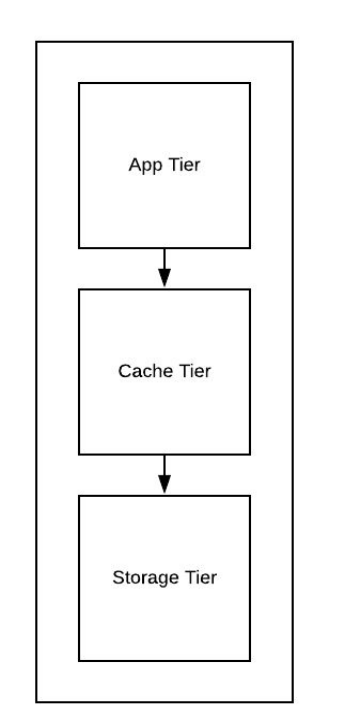
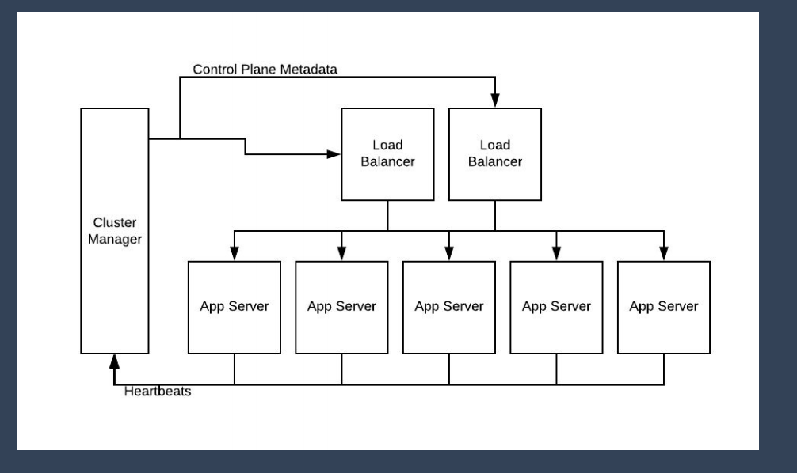
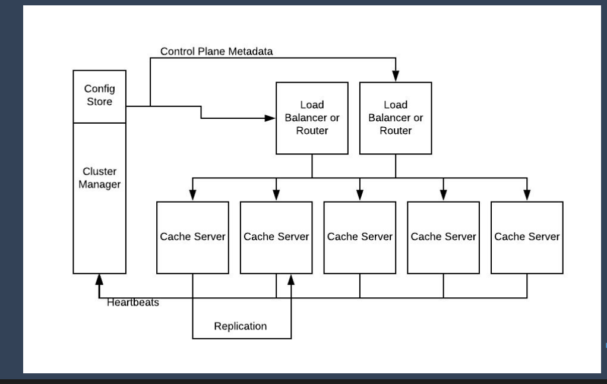
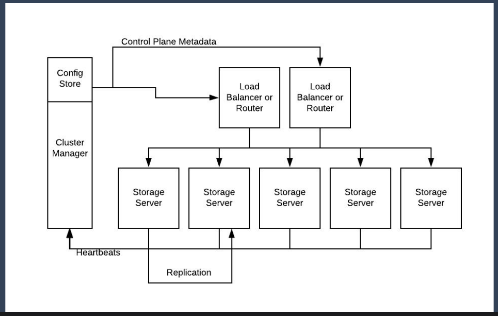

# Step 1: 
## a. Collect functional requirement
- One to one chatting
- Online/Sent/Read status
- Sending picture or other files
## b. Collect design constraints
### Message retention
- Facebook keeps all the data in the messaging system until user go ahead and delete it
- Whatsapp delete the message as soon as others receives the message
### Message security 
- Facebook can read the message until you turn on end to end message encryption
- Whatsapp has end to end message encryption i.e. middle tier can't read your message
### Traffic 
- Active connected user: 500 million
- Each user sends 40 messages daily
- Expected service response: 100ms
### Whatsapp Statistics
- 2 billion users
- One billion daily active users
- India is the biggest WhatsApp market in the world, with 200 million users
- 120 million WhatsApp users in Brazil
- US WhatsApp market relatively small, at 23 million
- 65 billion WhatsApp messages sent per day, or 29 million per minute
- Two billion minutes spent making WhatsApp voice and video calls per day
- 55 million WhatsApp video calls made per day, lasting 340 million minutes in total
- 85 billion hours of WhatsApp usage measured May-July 2018
- WhatsApp acquired by Facebook for $19 billion in 2014


# Step 2:
## a. Bucketize functional requirements into micro services
- User service
- Message service
- 

## b. Get clarity whether problem is breadth-oriented or depth-oriented
- Breadth oriented

# Step 3:
## a. Draw a logical diagram for messaging service
- Each system start out as a single machine
- Solve for single server system 


# Step 4:
## a. messaging service API layer
- UserA create websocket connection to server
    - At this moment, when userA is not sending data to server, they will heartbeat to each other
    - This way server knows that userA is still there
    - Also, userA knows that server is still there
- UserB create websocket connection to server
    - At this moment, when userB is not sending data to server, they will heartbeat to each other
    - This way server knows that userB is still there
    - Also, userB knows that server is still there  
- API to initiate connection init(userId)
- API for heartbeat heartbeat(payload)
    ```
    {
        userId: 'userA', // primary key
        heartbeatTime: 'July 26 2020T17:54:33:000Z'
    }
    ```
- User keep calling heartbeat every one second to server then server will update it cache.
- If user die then server will stop updating user heartbeat details, other user can figure out last time userA was online. 
- Create conversation between userA and userB
    - /conversation 
    ```
    {
        conversationId: 1
        user1: 'userA'
        user2: 'userB'
        encryptionKey: 'sdfasf'
    }
    ```
- UserA sends message to server asking to deliver to UserB
    - Server first write message into persistent storage
    - if target user is online then send messages to connected target user
    - if target user is not online then do nothing (Based on last heartbeat time)
    - if target user comes online back then check the storage if there is undelivered message then send to target user and mark message as delivered.
- API to send message send(payload)
    ```
    {  
        conversationId: 1 
        from: 'userA'
        to: 'userB'
        message: 'hi',
        time: 'July 26 2020T17:54:33:000Z'
        delivered: false
    }
    ```
- Server will deliver message to connected UserB
- API to notify user
    - read(userId)
    ```
    {
        from: 'userA',
        to: 'userB',
        time: t1
    }
    ```

Do we need to scale?
- Single point failure
- Active connected user: 500 million
- Connection accepted by a single server: 100
- Number of servers required: 5 millions
Yes, we need to scale

## b. messaging service Cache layer
- Store heartbeat data in cache
- Do we need to scale?
    - Number of connected users: 500 millions
    - Size of payload: 100bytes
    - Total size of cache: 500 millions * 100 bytes= 50GB
Yes, need to scale cache layer

## c. messaging service storage layer
- Store message data in storage layer
- Do we need to scale?
    - Number of connected users: 500 millions
    - Number of messages sent by a user in  a day: 40
    - Size of payload: 1KB
    - Total number of message per day: 500 millions * 40 = 20 billions messages
    - Total size of messages per day = 20 billion * 1KB = 20 TB/day
    - For 5 years = 20TB * 365 * 5 = 36 PB
Yes, need to scale cache layer
- For user data
    - Number of connected users: 500 millions
    - Size of payload: 100bytes
    - Total size = 500 millions * 100 bytes = 50GB
- For conversations 
    - Number of connected users: 500 millions
    - Factor of conversation: 2
    - Size of payload: 100bytes
    - Total size = 500 millions * 2 * 100 bytes = 100GB
- To store unread state
```
    {
        from: 'userA',
        to: 'userB',
        time: t1
    }  
```
- To store read state
```
    {
        from: 'userA',
        to: 'userB',
        time: t1
    }  
```
Overall total size = 36PB + 0.00001 ~= 36PB

## d. Build scalable messaging service API layer
- UserA create websocket connection to server1
    - At this moment, when userA is not sending data to server1, they will heartbeat to each other
    - This way server1 knows that userA is still there
    - Also, userA knows that server1 is still there
- UserB create websocket connection to server2
    - At this moment, when userB is not sending data to server2, they will heartbeat to each other
    - This way server2 knows that userB is still there
    - Also, userB knows that server2 is still there  
- API for heartbeat heartbeat(payload)
    ```
    {
        userId: 'userA', // primary key
        serverId: 'server1',
        heartbeatTime: 'July 26 2020T17:54:33:000Z'
    }
    ```
- User keep calling heartbeat every one second to server then server will update it cache.
- If user die then server will stop updating user heartbeat details, other user can figure out last time userA was online. 
- UserA sends message to server1 asking to deliver to UserB
    - Server1 first write message into persistent storage
    - if target userB is online then send messages to connected server2
    - if target userB is not online then do nothing (Based on last heartbeat time)
    - if target userB comes online back then check the storage if there is undelivered message then send to target userB and mark message as delivered.
- API to send message send(payload)
    ```
    {    
        from: 'userA'
        to: 'userB'
        message: 'hi',
        url: ''
    }
    ```
- Server2 will deliver message to connected UserB

## d. Build scalable messaging service cache layer
- Total size of cache per day: 50GB
- Size of RAM per server: 10GB
- Number of servers: 5

## d. Build scalable messaging service storage layer
- For 5 years = 20TB * 365 * 5 = 36 PB
- Data schema
    ```
    {   
        id: '1' 
        from: 'userA'
        to: 'userB'
        message: 'hi',
        url: ''
    }
    ```
- store rowwise
- Storage limit of one shard: 2TB
- Number of shards required:  18,000


# Additional requirement
## How to handle sending images?
- userA will send encrypted image to server1
- server1 will store picture in blob storage and get the url back
- server1 will store url in conversation storage
## Can we optimize storing data?
- Keep only last 7 days active conversation between user in the storage server
- All old data, extract from storage, convert into blob and push to blob storage server
- If user is trying to read 7 days old data then it will retrieve from blob storage and send to user
## Search on chat history
- Search based on text message
- Building inverted index will be compute heavy
## Can we support group based messaging
- Introduce group table
- Add members and conversationid
- Remaining algo will be same
